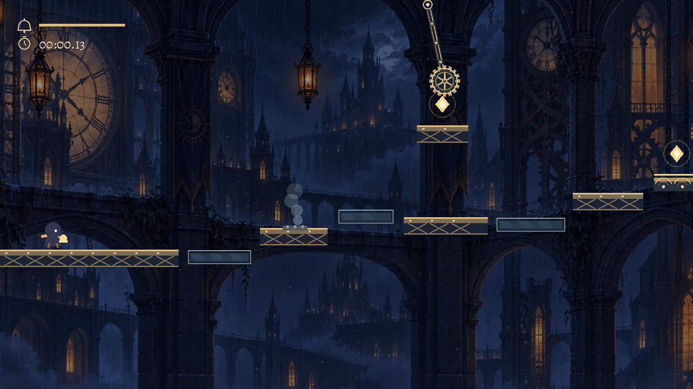
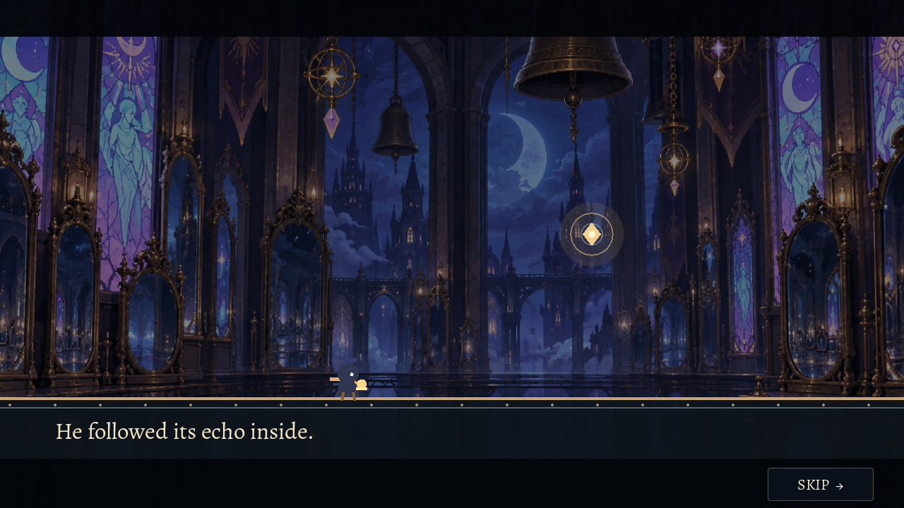
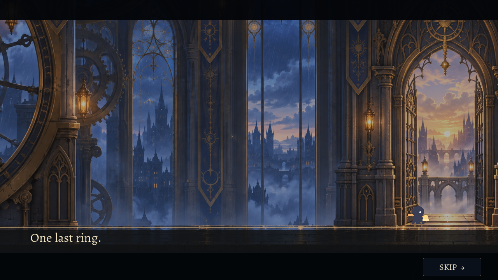

# One More Bell: Resonance

A short, replayable 2D platformer set inside a rain-soaked clocktower. A little bellkeeper follows an unfamiliar echo inside. To find the way out, you have to make the tower answer back.

Ring your handbell to turn glass ledges solid for a few seconds, use bronze platforms to launch upward and recharge, and time delayed echoes to cross longer gaps. The bell cannot be spammed: a mistimed press earns a head shake while it recharges.

## What’s inside

- Five distinct courses, from the Rain Arcade to the Great Belfry, with branching routes and different obstacle combinations.
- A brief visual prologue when you select **Play**, and an escape ending after all five courses.
- Three optional echo notes per course, individual best times, all-notes records, medals, and an optional personal-best ghost.
- Pendulums, spikes, pistons, and steam traps with visible wind-ups. A fall or hit restarts the course from the beginning; there are no checkpoints.
- Adjustable audio, bell timing, movement, ghost visibility, character appearance, display mode, resolution, VSync, parallax, camera shake, flashes, particles, contrast, and keyboard bindings.

| Prologue | Escape |
| --- | --- |
|  |  |

## Play

Open [`project.godot`](project.godot) in **Godot 4.7.2** and press **F5**. On Windows, you can also run [`PLAY.cmd`](PLAY.cmd); it looks for Godot on your PATH or in the standard WinGet installation location, imports the assets, and launches the game. The first import may take a moment.

To check the Windows asset import without opening the game, run `PLAY.cmd --verify` from Command Prompt.

Choose **Play** for the story route or **Courses** to replay a level directly. Cutscenes can be skipped with Space, Enter, Esc, a controller Start button, or the on-screen Skip button.

## Controls

| Action | Keyboard | Controller |
| --- | --- | --- |
| Move | A/D or arrow keys | Left stick |
| Jump | Space or Up | A |
| Ring | J or Shift | X |
| Pause | Esc | Start/Options |

Hold Jump for a higher leap, or release it for a short hop. The primary keyboard bindings can be changed in Settings.

## Records and settings

The five courses can be replayed individually. Each keeps a best time and a separate all-notes time. Custom bell, glass, or movement-speed settings are available, but runs using them do not set timed records. Saves and settings are stored in Godot’s `user://one_more_bell_resonance.cfg`, outside the project folder.

The game supports windowed, fullscreen, and borderless modes, with resolutions up to 2560 × 1440. Parallax makes distant scenery move more slowly than the playable course to give the tower depth; it can be disabled in Settings.

## Assets

The game art and audio are included in [`art/`](art/) and [`audio/`](audio/). The audio synthesis scripts are in [`tools/`](tools/). The Alegreya typeface is by Huerta Tipografica and is distributed under the SIL Open Font License; its license is included at [`art/Alegreya-OFL.txt`](art/Alegreya-OFL.txt).
