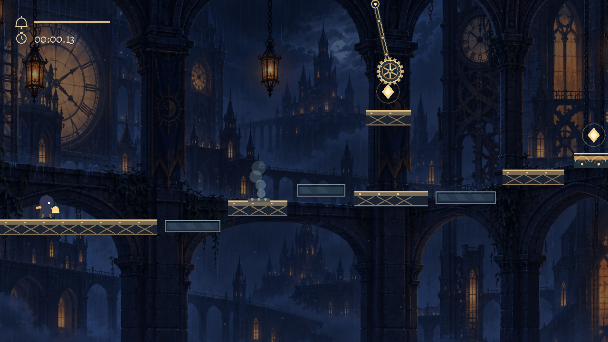
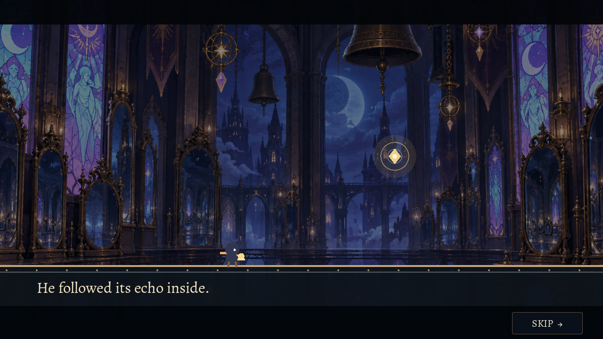
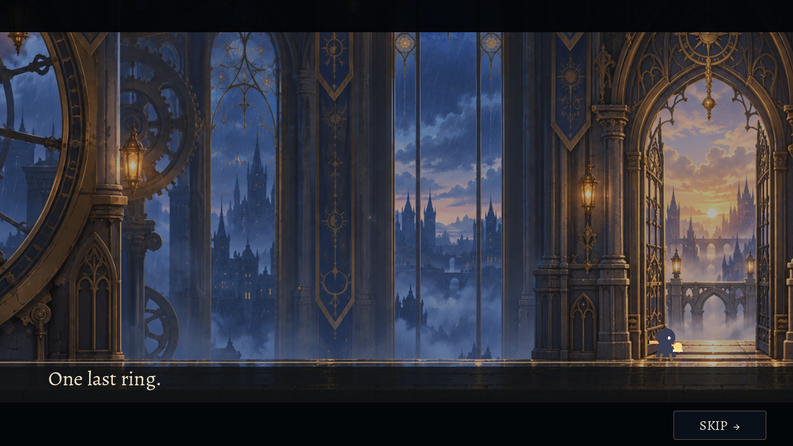
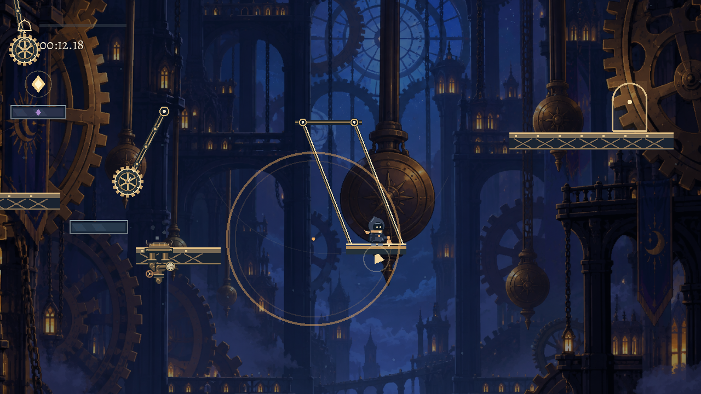
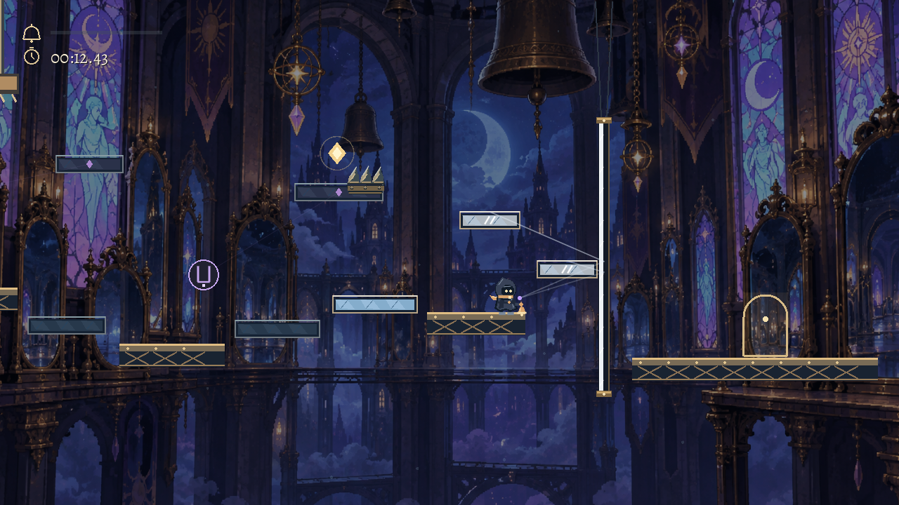
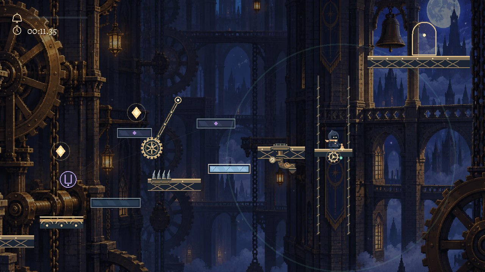
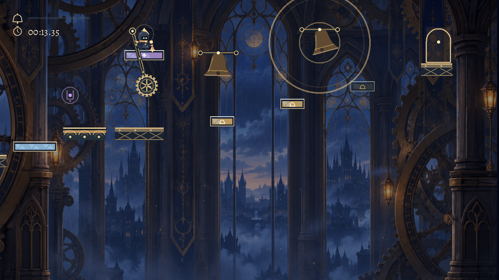

# One More Bell: Resonance



A short, replayable 2D platformer set inside a rain-soaked clocktower. A little bellkeeper follows an unfamiliar echo inside. To find the way out, you have to make the tower answer back.

Ring your handbell to turn nearby glass ledges solid for a few seconds, use bronze platforms to launch upward and recharge, and time delayed echoes to reach the upper routes. Ringing again will not extend a lit ledge's lifetime. A premature press gets a head shake without adding another cooldown penalty.

## What’s inside

- Five distinct courses, from the Rain Arcade to the Great Belfry, with branching routes and different obstacle combinations.
- Violet, diamond-marked ledges that respond to their linked echo fixture. Ring before a launch to have the next landing ready when you arrive.
- A new mechanism in each later course: a swinging seat in Pendulum Hall that you pump by ringing in time with it, a mirror wall in the Mirror Gallery whose reflections light silvered ledges, sound-driven lifts in the Clockwork Shaft, and great bells in the Great Belfry that toll back, light amber glass and wake one another.
- Four bellkeepers with running strides, rising and falling poses, weighted landings, bell swings, blinking eyes, and moving scarves.
- A brief visual prologue when you select **Play**, and an escape ending after all five courses.
- Three optional echo notes per course, individual best times, all-notes records, medals, and an optional personal-best ghost.
- Pendulums, forged spike racks, pistons, and brass steam pipes. Pipe gauges rise, outlets rattle, and wisps escape before the full burst. Spike and pipe designs vary between courses. A fall or hit restarts the course from the beginning; there are no checkpoints.
- Adjustable audio, bell timing, movement, ghost visibility, character appearance, display mode, resolution, VSync, parallax, camera shake, flashes, particles, contrast, and keyboard bindings.

| Prologue | Escape |
| --- | --- |
|  |  |

| Pendulum Hall: the swing | Mirror Gallery: the mirror |
| --- | --- |
|  |  |
| **Clockwork Shaft: the lift** | **Great Belfry: the great bells** |
|  |  |

## Play from source

On an x64 Windows 10/11 PC, extract the complete game folder and double-click [`PLAY.cmd`](PLAY.cmd). It checks Windows, PowerShell, the game files, and the standard **Godot 4.7.2** engine before importing assets and launching. The first import may take a moment.

If Godot is missing, the launcher asks permission before downloading the official release, verifies its SHA-512 checksum, and installs a private copy in `%LOCALAPPDATA%\Resonance\Godot\4.7.2`. Choosing No cancels without installing anything. Setup does not require administrator access, WinGet, Python, Git, or the .NET SDK, and does not replace other Godot versions. Internet access is only needed for the initial download; an installed engine works offline.

The launcher searches the game folder, its `Godot` subfolder, PATH, and standard WinGet package folders. For an engine elsewhere, set `GODOT_EXE` to its executable. You can also open [`project.godot`](project.godot) directly in Godot 4.7.2 and press **F5**.

Run `PLAY.cmd --check` for prerequisite checks only, or `PLAY.cmd --verify` to also import and check assets without opening the game. Neither option prompts or installs software. Launcher import and game logs are saved in `%LOCALAPPDATA%\Resonance\logs`. A compatible graphics driver supporting OpenGL 3.3 is still required; the launcher cannot install drivers or guarantee hardware compatibility.

Keep `tools/launch.ps1` with the game: `PLAY.cmd` calls it automatically. Its PowerShell execution-policy setting applies only to that process, not to the machine's permanent settings.

Choose **Play** for the story route or **Courses** to replay a level directly. Cutscenes can be skipped with Space, Enter, Esc, a controller Start button, or the on-screen Skip button.

## Controls

| Action | Keyboard | Controller |
| --- | --- | --- |
| Move | A/D or arrow keys | Left stick |
| Jump | Space or Up | A |
| Ring | J or Shift | X |
| Pause | Esc | Start/Options |

Hold Jump for a higher leap, or release it for a short hop. The primary keyboard bindings can be changed in Settings.

## Bell timing

The handbell reaches 340 world pixels; an echo reaches 520. Ordinary glass lasts 3.6 seconds with the default settings. Violet shortcut glass lasts about 2.45 seconds and only responds to its connected fixture, whose pulse follows a 0.62-second wind-up. Fine lines connect the fixture to its ledges, and its prongs close before it releases the pulse. A dim fixture is still resetting.

Lit ledges cannot be refreshed. Watch for the final blink, and commit when the next landing will still be there. Bronze launches restore your handbell immediately, but they do not reset an echo fixture. The lower routes give you places to stop; the upper routes reward planning ahead.

## Mechanisms

- **Swing (Pendulum Hall).** Jump onto the seat and face right. Press Left Shift to ring as the seat swings left, then let it travel right without ringing. Repeat to build enough height to jump to the far platform. The seat hangs on a pendulum whose period follows T = 2π√(L/g); a ring pushes it in the direction you face while riding.
- **Mirror (Mirror Gallery).** The mirror is a solid wall that reflects your ring. Silvered ledges, marked with two slashes, ignore the handbell and only light when a reflection reaches them. The angle of incidence equals the angle of reflection, and faint lines show the path when it works.
- **Lift (Clockwork Shaft).** A lift climbs while the sound of your bell reaches its gear, then sinks slowly once the tower falls quiet. Ring again as it climbs to keep it going.
- **Great bells (Great Belfry).** A great bell swings back for a moment, then tolls. The toll lights amber, bell-marked glass (which ignores the handbell) and can ring the next great bell along. A bell that has just tolled needs a short rest.

Swings, lifts and great bells answer your handbell and each other's tolls, but not the violet echo pulses.

## Records and settings

The five courses can be replayed individually. Each keeps a best time and a separate all-notes time. Custom bell, glass, or movement-speed settings are available, but runs using them do not set timed records. Saves and settings are stored in Godot’s `user://one_more_bell_resonance.cfg`, outside the project folder. The revised routes use a separate record set, so older times and ghosts do not compete against a changed course. Your settings and completed courses remain; the old records are retained in the save file.

The game supports windowed, fullscreen, and borderless modes, with resolutions up to 2560 × 1440. Parallax makes distant scenery move more slowly than the playable course to give the tower depth; it can be disabled in Settings.

## Tests

On Windows, run `powershell -NoProfile -ExecutionPolicy Bypass -File tools/test_launcher.ps1` to check setup consent, engine versions, download integrity, installation failures, and launch sequencing. These checks use temporary fixtures and do not download Godot or change your installed engine.

After importing the project, run these with Godot from the project directory:

```text
godot --headless --path . --script res://tools/test_all.gd
godot --headless --path . --script res://tools/test_timing.gd
godot --headless --path . --script res://tools/test_hazard_art.gd
godot --headless --path . --script res://tools/test_ghost.gd
godot --headless --path . --script res://tools/test_mechanisms.gd
godot --headless --path . --script res://tools/route_bot.gd
```

The test harness disables save loading and writing, so it cannot overwrite personal records or settings. `test_all.gd` covers controls, collisions, settings, retries, and story transitions. `test_timing.gd` checks pulse reach, expiry, echo timing, and cosmetic-only character poses. `test_hazard_art.gd` validates every spike and pipe mesh through a full steam cycle, including high contrast. `test_ghost.gd` checks that the personal-best ghost replays a run frame for frame and that older saved ghosts still play smoothly. `test_mechanisms.gd` checks the swing's period and resonance, reflection off the mirror, the lift's climb and sink, the great-bell chain, and that each new section cannot be skipped without its mechanism. `route_bot.gd` replays recorded inputs from spawn to exit, collecting every note without deaths on all five courses. It also tests mistimed ringing against the same movement inputs.

